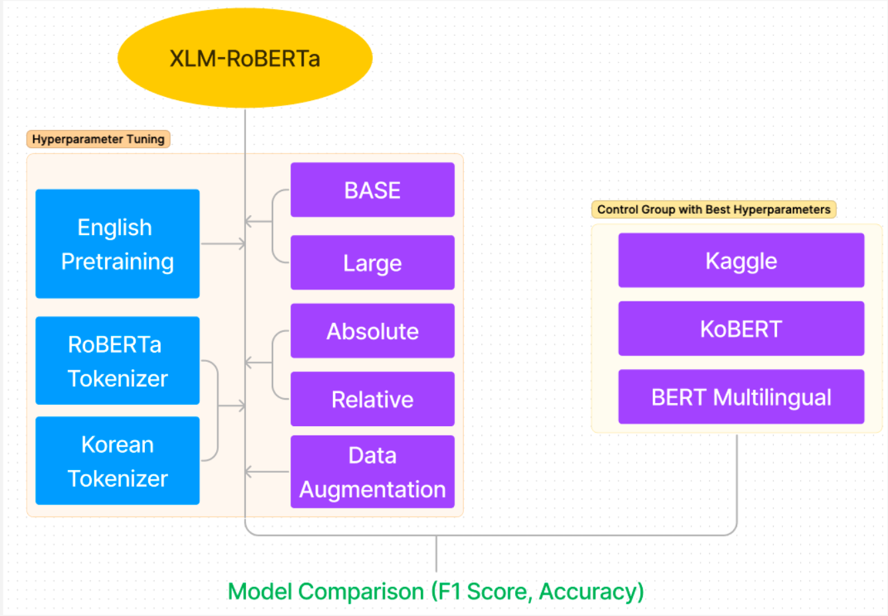

# Korean Hate Speech Detection

## Motivation

Offensive language causes a great deal of conflict between people of different political ideologies, genders, races, and generations. Recent research focuses heavily on offensive datasets in English, as there are numerous offensive datasets in English available on the Internet.

## Relative Works

The evident challenge of studies on this topic is how to deal with different languages. Cross-lingual embedded models, XLM-R [Conneau et al., 2019](#references), are suggested to take advantage of profoundness of English sources [Ranasinghe and Zampieri, 2020](#references). It explain XLM-R are exploited to deal with non-English languages without performance degradation. For Korean, there is single active Kaggle competition with Korean Hate Speech Dataset [Jihyung Moon et al., 2020](#references)

## Methods & Experiment

> Hyperparameter Tuning (XLM-R)

-   Cross-lingual transfer learning with relative position encoding

-   Adapting morpheme tokenizer of Korean

-   Data Augmentation

-   Various Pretrain methods

## Result

#

### **Overview**

|        Model         |            Evaluation Result             |
| :------------------: | :--------------------------------------: | --- |
| Kaggle Leading Group |                  0.677                   |
|  Multi-lingual BERT  |                  0.548                   |
|        KoBERT        |                  0.604                   |     |
|      **XLM-R**       | **0.690** |

 

### **Hyperparameter Tuning**

|                             Model                             |            Evaluation Result             | F1 Score |
| :-----------------------------------------------------------: | :--------------------------------------: | :------: |
|                          XLM-R Base                           |                  0.650                   |  0.641   |
|          XLM-R Base + Relative Positional Embedding           |                  0.555                   |  0.533   |
|                 XLM-R Base + English-pretrain                 |                  0.618                   |  0.612   |
| XLM-R Base + English-pretrain + Relative Positional Embedding |                  0.606                   |  0.593   |
|                XLM-R Large + English-pretrain                 |                  0.618                   |    -     |
|                XLM-R Large + Sandwich-pretrain                | **0.694** |  0.691   |
|      XLM-R Large + Sandwich-pretrain + Korean-tokenizer       |                  0.690                   |  0.688   |

## Conclusion

XLM-R with cross-lingual transfer learning outperforms the other existing models in Korean hate speech detection.Base on this result, it is now possible to achieve higher performance using additional English datasets and advanced researches directly on Korean data.

To apply Korean tokenizer is the biggest challenge in this work. A linguistic awareness of given language makes a huge impact on performance specifically in Korean [Park et al., 2020](#references). In future work, it would be the first objective to fit existing Korean tokenizer such as Khaiii, Mecab into XLM-R model.

## Future Works

## References

[1] Tharindu Ranasinghe and Marcos Zampieri. 2020. Multilingual Offensive Language Identification with Cross-lingual Embeddings. In Proceedings of the 2020 Conference on Empirical Methods in Natural Language Processing (EMNLP), pages 5838–5844.

[2] Jihyung Moon, Won Ik Cho, Junbum Lee. 2020. BEEP! Korean Corpus of Online News Comments for Toxic Speech Detection

[3] MacAvaney S, Yao H-R, Yang E, Russell K, Goharian N, Frieder O (2019) Hate speech detection: Challenges and solutions. PLoS ONE 14(8): e0221152.

[4] Jacob Devlin, Ming-Wei Chang, Kenton Lee, & Kristina Toutanova. (2018). BERT: Pre-training of Deep Bidirectional Transformers for Language Understanding. ArXiv: Computation and Language.

[5] Pires, T., Schlinger, E., & Garrette, D. (2019). How Multilingual is Multilingual BERT?. In Proceedings of the 57th Annual Meeting of the Association for Computational Linguistics (pp. 4996–5001). Association for Computational Linguistics.

[6] Matthew S. Dryer and Martin Haspelmath (2013). WALS Online. Max Planck Institute for Evolutionary

[7] Park, Kyubyong and Lee, Joohong and Jang, Seongbo and Jung, Dawoon. 2020. An Empirical Study of Tokenization Strategies for Various Korean NLP Tasks. ArXiv: Computation and Language.
